# Current Death Classification Workflow

Method version: `death_classification_consensus_v3_all_time_20260727`

This diagram documents the production classification-only workflow. Segmentation
is immutable. The workflow reads the existing original and nucleated-only masks,
performs multichannel classification, and applies one density- and
time-calibrated death-refinement method to every image, regardless of time point
or treatment.

Printable single-page vector version:
[`death_classification_workflow.pdf`](death_classification_workflow.pdf).

The editable Mermaid source is
[`death_classification_workflow.mmd`](death_classification_workflow.mmd).

## Current final-state contract

- Confirmed base-stage Dead calls are never demoted.
- Every current live, countable, non-border object is evaluated by the same
  refinement rules; neither treatment nor elapsed time is an eligibility gate.
- Object features are interpolated continuously over density and 12-hour
  untreated time anchors. There are no discrete time calibration bins.
- Persistent field collapse is evaluated over the complete trajectory and is
  backfilled to the first frame of a confirmed run, avoiding a confirmation-step
  artifact.
- The former 72-hour boundary is retained only as a continuity audit: its
  largest adjacent-frame change must remain within 0.5 percentage points of the
  non-boundary 95th percentile. It is never an eligibility rule.
- Rescue requires field plus object consensus, a confident temporal remnant,
  dual-view confirmation from a matched Dead partner, or complementary
  multisignal evidence across a matched pair after both branches agree that the
  field is collapsed.
- The complementary branch rule resolves view-specific geometry conflicts only
  when one view has object-level death evidence and the two views jointly carry
  at least three death signals; the call is propagated symmetrically to preserve
  branch agreement.
- Conflicting evidence is routed to `uncertain`.
- Supplemental confirmed Dead objects remain independently countable and may
  spatially overlap a live cell mask.
- The authoritative field table uses original-branch counts and retains the
  nucleated-only branch as a diagnostic view.
- No manual biological ground truth is available. Confidence and GO/NO-GO gates
  are operational validation, not sensitivity or specificity estimates.
